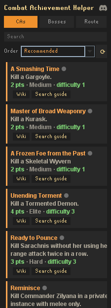
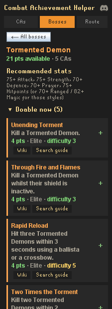
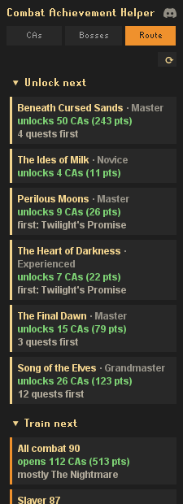

# Combat Achievement Helper

A RuneLite plugin that reads your Combat Achievement progress and tells you what to do next, based on
what your account can actually do.

  
  
  

| Mode | Answers |
|------|---------|
| **CAs** | "What can I knock out right now?" |
| **Bosses** | "What's worth going to?" |
| **Route** | "How do I reach the next tier?" with the quests and training that open more |

Recommendations respect how far you are from each task's recommended stats, so a fresh account
isn't routed at endgame bosses just because they're worth points. Everything ships with the plugin
and runs locally, nothing is sent anywhere.

## Licence

BSD 2-Clause, see [LICENSE](LICENSE).

The sidebar icon is the in-game Combat Achievements task book, from the
[OSRS Wiki](https://oldschool.runescape.wiki/w/Combat_Achievements). Old School RuneScape is a
trademark of Jagex Ltd; game assets remain their property.
